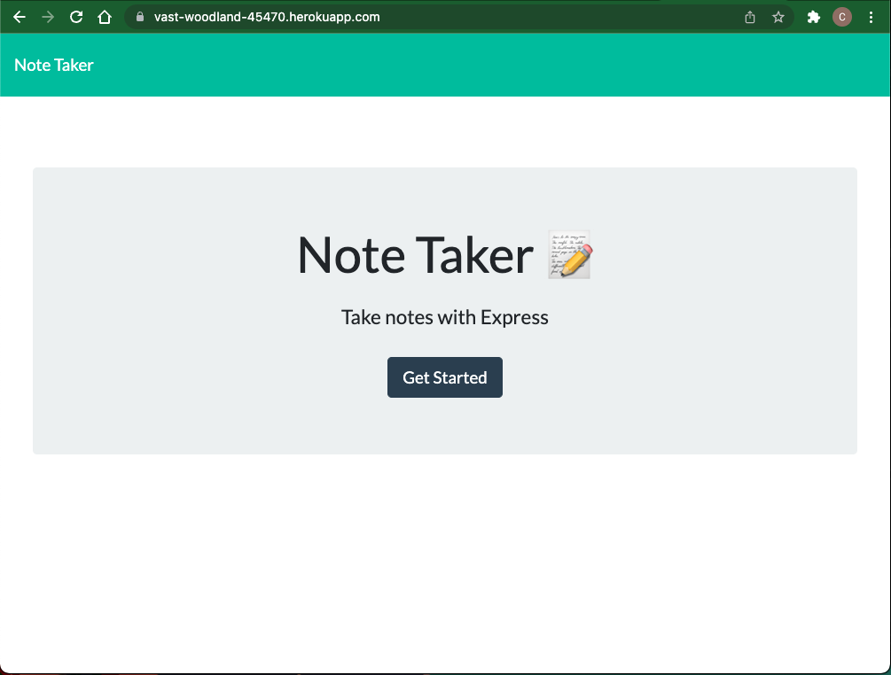
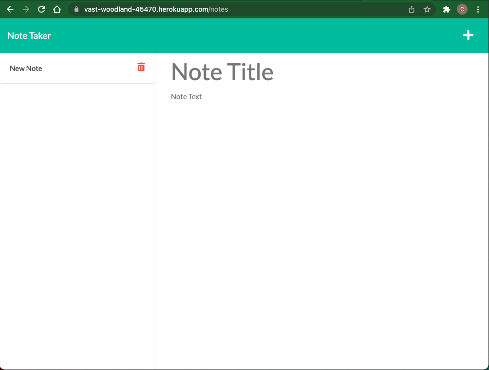

# Note-Taker Application

### Project Creator
Cory Davis

## Description
This application allows the user to easily take notes, store notes, and, upon completion of the task, delete notes from a saved note list. 

Upon navigating to the landing page, the user is prompted to "GET STARTED". Once you click the button you are then directed to the application note page where you can add, reference or delete a note. To add a note, click the plus sign in the upper right corner Enter a note title and description. Once, the text prompts are filled then a save button appears. Click the save button and the note is saved in the left hand column for future reference.

To delete a note, simply click on the trash can icon beside the corresponding note and the note will be deleted from the db array.

## Link to GitHub Repository
https://github.com/cmd0160/Note-Taker

## Link to Deployed Website
https://vast-woodland-45470.herokuapp.com

## Application Landing Page

## Application Home Page

